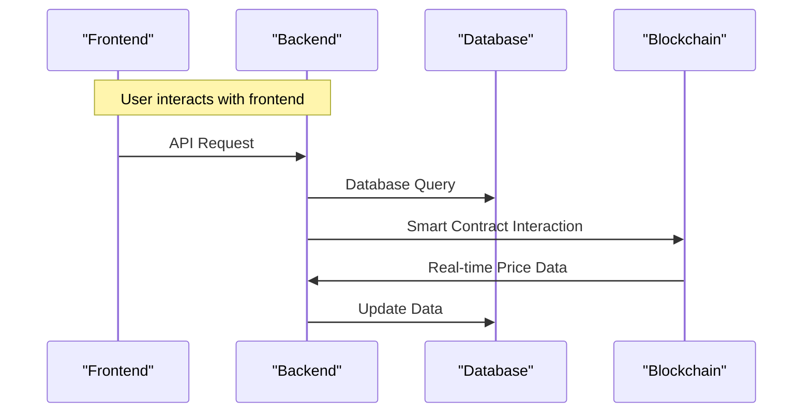

# System Overview
The MOC Volatility Mitigation & Optimization Platform (V-MOP) is a decentralized application designed to reduce risk and enhance trading opportunities for Mossland Ecosystem Users. The system consists of a frontend built with Next.js, a backend built with Express, a PostgreSQL database, and an Ethereum blockchain.

## High-Level Diagram
```mermaid
graph LR;
    A[Frontend] -->|API Requests|> B[Backend];
    B -->|Database Queries|> C[PostgreSQL];
    B -->|Smart Contract Interactions|> D[Ethereum Blockchain];
    D -->|Real-time Price Data|> B;
```

# Component Architecture
## Frontend
* Built with Next.js
* Responsible for user interface and user experience

## Backend
* Built with Express
* Handles API requests and interactions with the database and blockchain

## Database
* PostgreSQL database
* Stores user data, insurance policies, and trade history

## Blockchain
* Ethereum blockchain
* Hosts smart contracts for insurance policies and trading strategies

# Data Flow
1. User interacts with the frontend to purchase an insurance policy or execute a trade.
2. Frontend sends API request to backend.
3. Backend processes request and interacts with database to retrieve or store data.
4. Backend interacts with blockchain to execute smart contract functions.
5. Blockchain provides real-time price data to backend.
6. Backend updates database with new data.

## Data Flow Diagram


# API Design
## Endpoints
### Insurance Policies
* `GET /api/users/{userId}/insurance-policies`: Retrieve all insurance policies for a specific user.
* `POST /api/users/{userId}/insurance-policies`: Purchase a new insurance policy for the user.

### Trades
* `GET /api/users/{userId}/trades`: Retrieve all trades for a specific user.

## Request/Response Formats
* Requests: JSON
* Responses: JSON

# Database Schema
## Conceptual Schema
```sql
CREATE TABLE users (
    id SERIAL PRIMARY KEY,
    username VARCHAR(255) NOT NULL,
    email VARCHAR(255) NOT NULL
);

CREATE TABLE insurance_policies (
    id SERIAL PRIMARY KEY,
    user_id INTEGER NOT NULL REFERENCES users(id),
    policy_type VARCHAR(255) NOT NULL,
    coverage_amount DECIMAL(10, 2) NOT NULL
);

CREATE TABLE trades (
    id SERIAL PRIMARY KEY,
    user_id INTEGER NOT NULL REFERENCES users(id),
    trade_type VARCHAR(255) NOT NULL,
    amount DECIMAL(10, 2) NOT NULL
);
```

# Security Considerations
* Implement proper authentication and authorization mechanisms.
* Use secure communication protocols (HTTPS).
* Validate and sanitize user input.
* Regularly update dependencies and patch vulnerabilities.

# Scalability Notes
* Design the system to handle increased traffic and user growth.
* Implement load balancing and caching mechanisms.
* Optimize database queries and indexing.

# Deployment Architecture
## Production Environment
* Frontend: Hosted on a cloud provider (e.g. AWS).
* Backend: Hosted on a cloud provider (e.g. AWS).
* Database: Hosted on a cloud provider (e.g. AWS RDS).
* Blockchain: Interacts with the Ethereum mainnet.

## Development Environment
* Frontend: Hosted locally.
* Backend: Hosted locally.
* Database: Hosted locally.
* Blockchain: Interacts with a testnet or local blockchain simulator.